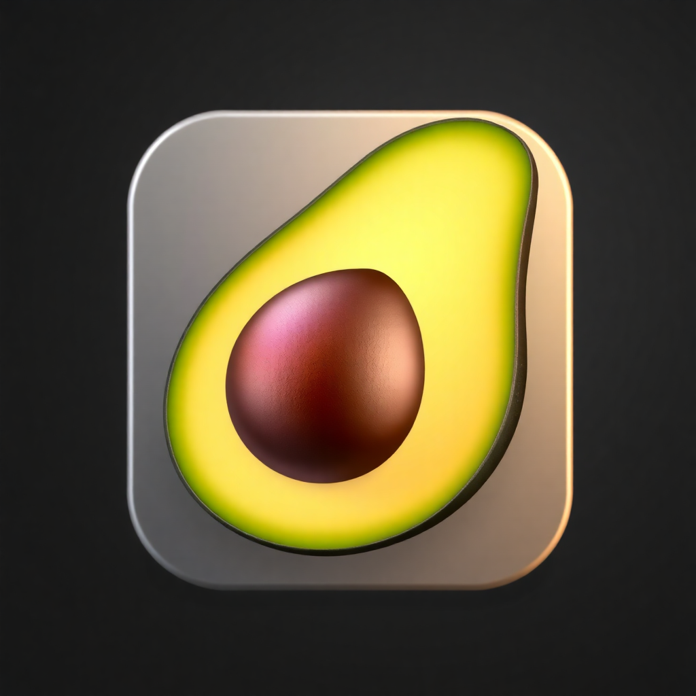

# 🥑 Anan - TouchBar Customization Tool

<div align="center">



**Customize Your TouchBar, Your Way**

[](https://opensource.org/licenses/MIT)
[](https://www.apple.com/macos/)
[](https://swift.org/)
[](CONTRIBUTING.md)

*An open-source TouchBar customization tool for macOS, built on the foundation of MTMR*

</div>

---

## 🎯 What is Anan?

**Anan** is a powerful, open-source TouchBar customization tool that gives you complete control over your MacBook's TouchBar. Built on the solid foundation of the MTMR project, Anan provides an intuitive interface for creating, managing, and customizing TouchBar widgets.

### ✨ Key Features

- 🎛️ **Widget Browser** - Browse and add widgets with ease
- ⚡ **Quick Configuration Tools** - Duplicate, delete, and export widgets
- 🎨 **Advanced Visual Editor** - Create custom widget layouts
- 🔧 **Centralized Preset Management** - Single configuration file for consistency
- 🚀 **Smart Permission Handling** - No more annoying permission prompts
- 📊 **Performance Monitoring** - Real-time operation tracking
- 🔒 **Automatic Backups** - Your configurations are always safe
- 🌟 **Modern SwiftUI Interface** - Beautiful, responsive design

---

## 🚀 Getting Started

### Prerequisites

- **macOS 11.0+** (Big Sur or later)
- **Xcode 13.0+** (for development)
- **TouchBar-enabled MacBook** (2016 or later)

### Installation

#### Option 1: Download Pre-built App
1. Go to [Releases](https://github.com/yourusername/anan/releases)
2. Download the latest `.dmg` file
3. Drag Anan to your Applications folder
4. Launch and grant necessary permissions

#### Option 2: Build from Source
```bash
# Clone the repository
git clone https://github.com/yourusername/anan.git
cd anan

# Open in Xcode
open Anan.xcodeproj

# Build and run
xcodebuild -project Anan.xcodeproj -scheme Anan -configuration Release build
```

### First Launch

1. **Launch Anan** from your Applications folder
2. **Grant Accessibility Permission** when prompted (required for TouchBar control)
3. **Start Customizing** - Add your first widget from the menu!

---

## 🎨 Usage Guide

### Adding Widgets

#### Quick Widget Addition
1. Click the Anan menu bar icon
2. Select **Quick Add** → Choose widget type
3. Widget appears immediately on your TouchBar!

#### Widget Browser
1. Open **Widget Browser** from the menu
2. Browse categories (System, Media, Information, etc.)
3. Click **Add** on any widget you like
4. Customize settings and add to TouchBar

### Managing Widgets

#### Quick Actions
- **Duplicate** - Copy existing widgets
- **Delete** - Remove unwanted widgets
- **Export** - Save configurations for backup

#### Preset Management
- **Save Current** - Save your current setup as a preset
- **Load Preset** - Switch between different configurations
- **Export/Import** - Share configurations with others

### Advanced Configuration

#### Visual Editor
- Drag and drop widgets
- Adjust positioning and sizing
- Preview changes in real-time
- Save custom layouts

#### Performance Monitoring
- Track operation speeds
- Identify bottlenecks
- Optimize widget performance
- Monitor TouchBar reload times

---

## 🏗️ Architecture

Anan is built with modern software engineering principles:

### Core Components

- **`CentralizedPresetManager`** - Single source of truth for all configuration
- **`EnhancedPermissionManager`** - Smart permission handling and caching
- **`PerformanceMonitor`** - Real-time performance tracking and optimization
- **`TouchBarController`** - Direct TouchBar integration and management

### Design Principles

- **Single Source of Truth** - All changes go through centralized managers
- **Separation of Concerns** - Clear layers for UI, business logic, and data
- **Smart Resource Management** - Efficient permission and file handling
- **Performance First** - Monitor and optimize all operations

### File Structure

```
Anan/
├── Core/                    # Core application logic
├── UI/                     # SwiftUI components
├── PresetManagement/       # Configuration management
├── Widgets/                # Widget implementations
├── Documentation/           # Project documentation
└── Resources/              # Assets and resources
```

---

## 🔧 Development

### Setting Up Development Environment

1. **Clone the repository**
   ```bash
   git clone https://github.com/yourusername/anan.git
cd anan
   ```

2. **Open in Xcode**
   ```bash
   open Anan.xcodeproj
   ```

3. **Build and run**
   - Select the Anan scheme
   - Choose your target device
   - Press Cmd+R to build and run

### Development Guidelines

- Follow the [Development Checklist](DEVELOPMENT_CHECKLIST.md)
- Read the [Architecture Documentation](ARCHITECTURE.md)
- Use the [Best Practices Guide](README_BEST_PRACTICES.md)
- Ensure all tests pass before submitting PRs

### Code Style

- **Swift**: Follow [Swift Style Guide](https://swift.org/documentation/api-design-guidelines/)
- **SwiftUI**: Use proper property wrappers and state management
- **Documentation**: Add comprehensive comments for public APIs
- **Testing**: Include unit tests for new features

---

## 🤝 Contributing

We welcome contributions from the community! Here's how you can help:

### Ways to Contribute

- 🐛 **Report Bugs** - Help us identify and fix issues
- 💡 **Suggest Features** - Share your ideas for improvement
- 🔧 **Submit Code** - Contribute bug fixes and new features
- 📚 **Improve Documentation** - Help make Anan easier to use
- 🌍 **Localization** - Help translate Anan to your language
- ⭐ **Star the Project** - Show your support!

### Contribution Process

1. **Fork the repository**
2. **Create a feature branch**
   ```bash
   git checkout -b feature/amazing-feature
   ```
3. **Make your changes**
4. **Test thoroughly**
5. **Commit with clear messages**
   ```bash
   git commit -m "Add amazing new feature"
   ```
6. **Push to your fork**
   ```bash
   git push origin feature/amazing-feature
   ```
7. **Create a Pull Request**

### Development Resources

- [Development Checklist](DEVELOPMENT_CHECKLIST.md) - Step-by-step development guide
- [Architecture Documentation](ARCHITECTURE.md) - System design and patterns
- [Best Practices](README_BEST_PRACTICES.md) - Coding guidelines and examples
- [Performance Guidelines](ARCHITECTURE.md#performance-considerations) - Optimization tips

---

## 📋 Roadmap

### Short Term (Next 3 months)
- [ ] Widget template library
- [ ] Advanced configuration UI
- [ ] Preset sharing system
- [ ] Performance dashboard improvements

### Medium Term (3-6 months)
- [ ] Plugin system architecture
- [ ] Cloud configuration sync
- [ ] Advanced analytics
- [ ] Mobile companion app

### Long Term (6+ months)
- [ ] AI-powered widget suggestions
- [ ] Cross-platform support
- [ ] Enterprise features
- [ ] Community marketplace

---

## 🏆 Credits & Acknowledgments

### Anan Contributors

**Core Development Team:**
- **Project Lead** - [Your Name](https://github.com/yourusername)
- **Architecture & Performance** - Enhanced TouchBar System
- **UI/UX Design** - Modern SwiftUI Interface
- **Documentation** - Comprehensive Guides & Best Practices

### MTMR Foundation

Anan is built on the excellent foundation of the **MTMR (My TouchBar My Rules)** project:

- **Original MTMR Project**: [https://github.com/toxblh/MTMR](https://github.com/toxblh/MTMR)
- **Original Author**: [toxblh](https://github.com/toxblh)
- **License**: MIT License (inherited and maintained)

*We extend our deepest gratitude to the MTMR project and its contributors for creating the foundation that made Anan possible.*

### Open Source Libraries

- **SwiftUI** - Modern UI framework by Apple
- **Foundation** - Core functionality by Apple
- **AppKit** - macOS integration by Apple

---

## 📄 License

This project is licensed under the **MIT License** - see the [LICENSE](LICENSE) file for details.

### What This Means

- ✅ **Free to use** - Personal and commercial use allowed
- ✅ **Free to modify** - Change the code as you need
- ✅ **Free to distribute** - Share with others
- ✅ **Attribution required** - Credit Anan and MTMR
- ✅ **No warranty** - Use at your own risk

### License Text

```
MIT License

Copyright (c) 2024 Anan Contributors

Permission is hereby granted, free of charge, to any person obtaining a copy
of this software and associated documentation files (the "Software"), to deal
in the Software without restriction, including without limitation the rights
to use, copy, modify, merge, publish, distribute, sublicense, and/or sell
copies of the Software, and to permit persons to whom the Software is
furnished to do so, subject to the following conditions:

The above copyright notice and this permission notice shall be included in all
copies or substantial portions of the Software.

THE SOFTWARE IS PROVIDED "AS IS", WITHOUT WARRANTY OF ANY KIND, EXPRESS OR
IMPLIED, INCLUDING BUT NOT LIMITED TO THE WARRANTIES OF MERCHANTABILITY,
FITNESS FOR A PARTICULAR PURPOSE AND NONINFRINGEMENT. IN NO EVENT SHALL THE
AUTHORS OR COPYRIGHT HOLDERS BE LIABLE FOR ANY CLAIM, DAMAGES OR OTHER
LIABILITY, WHETHER IN AN ACTION OF CONTRACT, TORT OR OTHERWISE, ARISING FROM,
OUT OF OR IN CONNECTION WITH THE SOFTWARE OR THE USE OR OTHER DEALINGS IN THE
SOFTWARE.
```

---

## 🆘 Support & Community

### Getting Help

- **Documentation**: Start with this README and the guides
- **Issues**: Report bugs and request features on [GitHub Issues](https://github.com/yourusername/anan/issues)
- **Discussions**: Join community discussions on [GitHub Discussions](https://github.com/yourusername/anan/discussions)
- **Wiki**: Check our [GitHub Wiki](https://github.com/yourusername/anan/wiki) for detailed guides

### Community Channels

- **GitHub**: [https://github.com/yourusername/anan](https://github.com/yourusername/anan)
- **Discussions**: [GitHub Discussions](https://github.com/yourusername/anan/discussions)
- **Issues**: [Bug Reports & Feature Requests](https://github.com/yourusername/anan/issues)

### Contributing Guidelines

- [Code of Conduct](CODE_OF_CONDUCT.md) - Community behavior standards
- [Contributing Guide](CONTRIBUTING.md) - How to contribute
- [Development Checklist](DEVELOPMENT_CHECKLIST.md) - Development guidelines
- [Architecture Guide](ARCHITECTURE.md) - System design documentation

---

## 🌟 Show Your Support

If Anan has been helpful to you, please consider:

- ⭐ **Star the repository** - Show your appreciation
- 🍕 **Sponsor the project** - Support ongoing development
- 📢 **Share with others** - Help grow the community
- 💬 **Provide feedback** - Help us improve
- 🔧 **Contribute code** - Help build new features

---

## 📊 Project Status

- **Current Version**: 1.0.0
- **Development Status**: Active Development
- **Last Updated**: August 2024
- **Next Release**: Coming Soon

---

<div align="center">

**Made with ❤️ by the Anan Community**

*Built on the foundation of MTMR - My TouchBar My Rules*

[](https://github.com/yourusername/anan)
[](https://github.com/yourusername/anan/fork)
[](https://github.com/yourusername/anan/issues)

</div>
